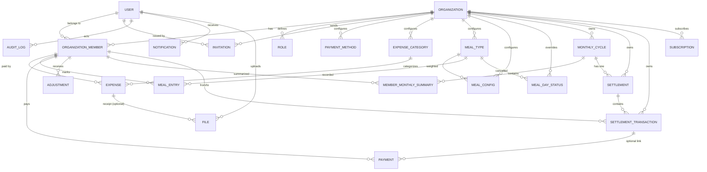

# MessMate — Database Design & Mongoose (Phase 1)

This document describes the MongoDB / Mongoose data layer built in Phase 1.

## 1. Money representation

All monetary values are stored as **integer minor units (paisa)**.

| Field | Stored as | Example |
| --- | --- | --- |
| `Expense.amount` | integer paisa | `৳100.50` → `10050` |
| `Payment.amount` | integer paisa | `৳5,000` → `500000` |
| `MemberMonthlySummary.totals.*` | integer paisa | |
| `SettlementTransaction.amount` | integer paisa | |

Rationale:

- Floating point cannot represent decimal money exactly; using integers eliminates rounding drift in calculations.
- Deterministic rounding is done once, with `Math.round` on integer inputs.
- Helpers live in `lib/money/money.ts` (`takaToPaisa`, `paisaToTaka`, `roundPaisa`, `formatPaisa`).
- **Sign convention (balances):** `netBalance > 0` ⇒ member owes; `< 0` ⇒ member receives; `0` ⇒ settled.

## 2. Models & collections

| Mongoose model | Collection | Purpose |
| --- | --- | --- |
| `User` | `users` | Identity + auth record |
| `Organization` | `organizations` | Tenant (mess/flat/hostel) |
| `Role` | `roles` | Extensible roles & permission sets |
| `OrganizationMember` | `organization_members` | Membership with effective dates |
| `Invitation` | `invitations` | Member invites (token hash stored) |
| `PaymentMethod` | `payment_methods` | Dynamic payment methods |
| `ExpenseCategory` | `expense_categories` | Dynamic categories (soft-archivable) |
| `MealType` | `meal_types` | Dynamic meal types |
| `MealConfig` | `meal_configs` | Meal weights with effective date history |
| `MealDayStatus` | `meal_day_statuses` | Per-day meal cancellation/override |
| `MealEntry` | `meal_entries` | Daily meal attendance |
| `Expense` | `expenses` | Expenses + distribution + grocery items |
| `Payment` | `payments` | Contributions / advances / refunds |
| `Adjustment` | `adjustments` | Manual credit/debit adjustments |
| `MonthlyCycle` | `monthly_cycles` | Accounting period with config snapshot |
| `MemberMonthlySummary` | `member_monthly_summaries` | Per-member monthly result |
| `Settlement` | `settlements` | Month settlement (who pays whom) |
| `SettlementTransaction` | `settlement_transactions` | Individual transfers in a settlement |
| `AuditLog` | `audit_logs` | Immutable audit trail |
| `Notification` | `notifications` | In-app notifications |
| `File` | `files` | Receipts/attachments (storage-ready) |
| `Subscription` | `subscriptions` | Subscription-ready billing data |

## 3. Domain / ER relationships



All organization-owned records carry `organizationId`. The client-supplied `organizationId` is never trusted; Phase 2 authorization resolves membership from the authenticated user.

## 4. Multi-tenancy

Every business model includes `organizationId: ObjectId → organizations`. Models that are purely personal (`User`, `AuditLog`, `Notification`, `File`) keep `organizationId` optional or absent but are always tenant-scoped at query time by Phase 2 services.

## 5. Historical integrity

Config changes must never silently corrupt past accounting:

- **Meal weights:** `MealConfig` stores `effectiveFrom` / `effectiveTo` / `isCurrent`. New weight sets create new rows; previous rows are closed with `effectiveTo`. Sum-to-100 is a cross-document rule enforced by `lib/schemas/meal-config.schemas.ts` (`setMealConfigSchema`) and (in Phase 2) the service layer.
- **Meal types / categories / payment methods:** soft archived (`status`, `archivedAt`), never physically deleted.
- **Membership periods:** `OrganizationMember.joinedAt` / `leftAt` / `status` enable mid-month join/leave accounting.
- **Period snapshot:** on finalization, `MonthlyCycle.snapshot` captures meal weights, categories, payment methods and membership as of that period; `MemberMonthlySummary` also snapshots the meal weight mode. Later config edits do not affect finalized periods.
- **Payment method history:** `Payment.methodId` + `methodName` snapshot preserves the name even after the method is archived.

## 6. Key indexes

| Collection | Index | Note |
| --- | --- | --- |
| users | `email` unique, `phone` (sparse unique), `status` | |
| organizations | `slug` unique, `status` | |
| organization_members | `(organizationId, userId)` unique, `(organizationId, status)`, `(organizationId, joinedAt)`, `(userId, status)` | |
| roles | `(organizationId, key)` unique, `(organizationId, isActive)` | |
| invitations | `tokenHash` unique, `(organizationId, email)` **partial unique** where `status=PENDING`, `(email)`, `(status, expiresAt)` | one pending invite per email per org |
| payment_methods | `(organizationId, name)` unique, `(organizationId, isActive, sortOrder)` | |
| expense_categories | `(organizationId, name)` unique, `(organizationId, status, sortOrder)` | |
| meal_types | `(organizationId, name)` unique, `(organizationId, status, sortOrder)` | |
| meal_configs | `(organizationId, mealTypeId, effectiveFrom)` unique, `(organizationId, isCurrent)` | |
| meal_day_statuses | `(organizationId, date, mealTypeId)` unique | |
| meal_entries | `(organizationId, memberId, date, mealTypeId)` unique, `(organizationId, date)`, `(organizationId, memberId, date)` | |
| expenses | `(organizationId, expenseDate)`, `(organizationId, categoryId)`, `(organizationId, paidByMemberId)`, `(organizationId, status)` | |
| payments | `(organizationId, paymentDate)`, `(organizationId, memberId)`, `(organizationId, type, status)` | |
| adjustments | `(organizationId, adjustmentDate)`, `(organizationId, memberId)` | |
| monthly_cycles | `(organizationId, periodKey)` unique, `(organizationId, status)` | |
| member_monthly_summaries | `(cycleId, memberId)` unique, `(organizationId, cycleId)` | |
| settlements | `(organizationId, cycleId)` unique, `(organizationId, status)` | |
| settlement_transactions | `(settlementId, fromMemberId, toMemberId)`, `(organizationId, status)` | |
| audit_logs | `(organizationId, createdAt)`, `(actorUserId, createdAt)`, `(entityType, entityId)` | |
| notifications | `(userId, status, createdAt)`, `(organizationId, userId, createdAt)` | |
| files | `(organizationId, createdAt)` | |
| subscriptions | `organizationId` unique | |

Indexes are declared inline on each schema and built with `model.createIndexes()` (see `yarn db:verify`).

## 7. Validation

Two complementary layers:

- **Mongoose schema validation** — required fields, enums, integer/positive money, refs, uniqueness.
- **Zod schemas at the application boundary** (`lib/schemas/*`) — full request shape validation including cross-field rules:
  - `PERCENTAGE` participants must total exactly 100.
  - `FIXED_AMOUNT` participants must total the expense amount.
  - `INDIVIDUAL` exactly one participant; `SELECTED_MEMBERS` at least two.
  - Meal weights must total 100 (`setMealConfigSchema`).
  - Money fields must be non-negative integers (paisa).

## 8. Dynamic configuration (not hard-coded)

Stored in MongoDB per organization: expense categories, meal types, meal weights, payment methods, roles/permissions. Only the *algorithm selector* is a controlled enum (`DISTRIBUTION_METHOD`), matching the requirement "distribution methods may use a controlled enum for algorithm selection, but the business rules must remain extensible."

## 9. Scripts

```bash
yarn db:verify            # compile models, print indexes, build indexes (needs MONGODB_URI)
yarn db:seed              # seed demo data
yarn db:seed --fresh      # drop + reseed
```

## 10. Known limitations / assumptions

- `passwordHash` is `select: false`; bcrypt hashing is Phase 2.
- Invitation emails are not sent in Phase 1 (only the token is generated/stored).
- Meal weight sum-to-100 is enforced in Zod and will be re-validated transactionally in Phase 2 services.
- `Subscription` is a minimal structure; no billing provider integration yet.
- File storage metadata only; actual upload/object storage is Phase 3+.
